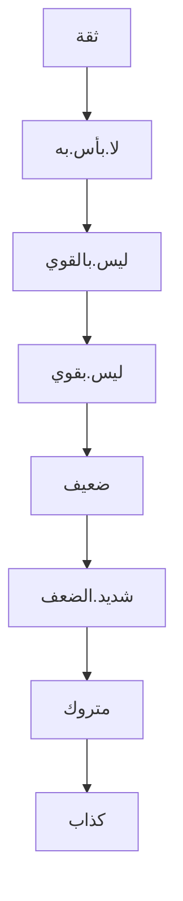

## ينقسم علم الحديث إلى: 1. المتن. 2. السند.

### ندرس في المتن جزئين:
1. مجرد نقل المتن كما قاله المصطفى ﷺ.
2. فقه المتن.

### الأقسام 3 الواردة عن النبي ﷺ:
قال رسول الله ﷺ: (نضَّرَ اللَّهُ امرأً سمِعَ منَّا حديثًا فحفِظَهُ حتَّى يبلِّغَهُ غيرَهُ فرُبَّ حاملِ ( كذا ) فقهٍ ليسَ بفَقيهٍ ورُبَّ حاملِ فقهٍ إلى من هوَ أفقَهُ منهُ ثلاثُ خصالٍ لا يُغلُّ عليهنَّ قلبُ مُسلِمٍ إخلاصُ العملِ للَّهِ والنَّصيحةُ لولاةِ الأمرِ ولزومُ الجماعةِ فإنَّ دعوَتَهُم تُحيطُ مَن وراءهم).

وأيضا قال: (مَن كَذَبَ عَلَيَّ مُتَعَمِّدًا، فَلْيَتَبَوَّأْ مَقْعَدَهُ مِنَ النَّارِ)

في هذه الأحاديث ذكر رسول الله ﷺ 3 أقسام وهي:
1. نقل الحديث دون التفقه فيه.
2. التفقه في المتن النبوي.
3. التحري في النقل والحذر من الكذابين والكذب.

### حرص النبي ﷺ على اعتناء أمته بسنته:
قال رسول الله ﷺ: (فإنَّه مَن يَعِشْ منكم فسيَرَى اختِلافًا كثيرًا، فعليكم بسُنَّتي وسُنَّةِ الخُلَفاءِ الرَّاشِدينَ، عَضُّوا عليها بالنَّواجِذِ، وإيَّاكم ومُحدَثاتِ الأُمورِ؛ فإنَّ كُلَّ بِدعةٍ ضَلالةٌ)

وأيضا قال: (فإنَّ خَيْرَ الحَديثِ كِتَابُ اللهِ، وَخَيْرُ الهُدَى هُدَى مُحَمَّدٍ).

وأيضا قال: (يَؤُمُّ القَوْمَ أَقْرَؤُهُمْ لِكِتَابِ اللهِ، فإنْ كَانُوا في القِرَاءَةِ سَوَاءً، فأعْلَمُهُمْ بالسُّنَّةِ).

هذه الأحاديث وغيرها تبين حرص النبي ﷺ على سنته المطهرة.

سنن رسول الله ﷺ تنقسم إلى قولية وفعلية (تقريراته يمكن ضمها إلى الفعلية).

### أقسام السنة باعتبار موضوعاتها:
1. الأحكام
2. المواغظ
3. الآداب
4. الأخبار المستقبلية
5. الأخبار الماضية
وغيرها.
### اعتناء الصحابة بالسنة بعد وفاة النبي ﷺ:
1. صحابة اهتموا بنقل الحديث مثل: أبوهريرة رضي الله عنه.
2. صحابة اهتموا بالفتوى بناءً على السنة مثل: ابن عباس، عمر بن الخطاب وعلي بن أبي طالب وغيرهم رضي الله عنهم أجمعين.

ملاحظة: لم يترك الصحابة أي جانب ولكن هذا ما اشتهر عنهم.
لم يكن ظبط السنة أمر معقد في زمن الصحابة لعدالتهم وقصر المدة الزمنية بينهم وبين النبي ﷺ؛ بالرغم من هذا اشتد الصحابة في الرواية حتى كان عمر رضي الله عنه يقول لبعض الصحابة "من يشهد معك".
ثم في نهاية زمن الصحابة ازداد التثبت والتحقق في الرواية لوفاة كبار الصحابة ولم يبقَ منهم إلا صغارهم وبدأ التابعين في الرواية.

### التابعون وطبقاتهم:

1. كبار التابعين: لم يدركوا النبيﷺ ولكن ادركوا بداية عصر الخلافة الراشدة. 
2. أواسط التابعين: الذين أدركوا نهاية الخلافة الراشدة.
3. صغار التابعين: لم يدركوا الخلافة الراشدة.
كبار التابعين مثل: قيس بن أبي حازم، الصنابحي، سعيد بن المسيب.
أواسط التابعين مثل: أبو اسحاق السبيعي.
صغار التابعين مثل: الزهري وقتادة.

### ازدهار التدقيق في الرواية والنقل في زمن التابعين:
أصبح هناك علماء مهتمون بتتبع الرواة والتثبت من صحة الروايات بشكل أكثر دقة مثل: ابن سيرين رحمه الله.
**"كلما كثرت التحديات ومداخل الإشكال داخل الرواية يزداد إلى الاحتياج للتدقيق فيها".**

- **الإمام الزهري هو من ركائز نقل السنة، وكلفه الخليفة عمر بن عبدالعزيز بجمع السنة.**

### الكتابة والمشافهة في نقل السنة في زمن التابعين:
السنة في زمن التابعين كانت تنقل مكتوبة و مشافهةً، ولكن الأصل هو المشافهة (وهي الأوثق)، بل بعض التابعين كانوا يحاربون مسألة الكتابة.

الكتابة في زمن التابعين كانت غير مصنفة.

### شبهات المستشرقين حول الحديث وتدوينه:
يستشكل المستشرقون والمشككون في السنة على المسلمين عدم وجود مخطوطات لبعض كتب السنة، ولكن في حقيقة الأمر أن المخطوطات في علم الحديث هي عبارة عن تحصيل حاصل، واعتمد المحققون لهذا العلم على الرواية المتواترة للكتاب وهي أشد موثوقية من المخطوطات.

### المدرسة الحديثية لابن سيرين في البصرة:
انشأ محمد بن سيرين مدرسة حديثية قوية في البصرة وعرف المتصلون بهذه المدرسة بقوتهم الحديثية مثل: أيوب السختياني، عبدالله بن عون، وأخذ عن أيوب حماد بن زيد (من أشهر الرواة الثقات).

### فقه الحديث في طبقة التابعين:
ظهر في التابعين علماء يفقهون ويعلمون الناس فقه السنة النبوية، من أبرزهم: الزهري، الحسن البصري، ابن سيرين، قتادة، وغيرهم.

### طبقة أتباع التابعين:
في عهد أتباع التابعين ظهر التصنيف (في باب نقل الحديث) ومن أشهر وأهم المصنفات هو كتاب الموطأ للإمام مالك بن أنس رحمه الله. كان الإمام ينقل الحديث فيكون هذا من (نقل الرواية) ومن ثم يعلق عليها فيكون هذا من (التفقه في السنة). 
- التصنيف: هو ترتيب الأحاديث المكتوبة لتكون مرتبة حسب الأبواب والموضوعات.

"يدخل في علوم الحديث حتى كلام الصحابة" وكلام الصحابة يسمى في مصطلح الحديث (موقوف).

إذا اسند مالك رحمه الله الحديث فاعلم أنه صحيح، وإذا قال بلغني فهو لا يثبت ويسمى الحديث مرسلاً.

### خدمة العلماء لكتب السنة:
موطأ الإمام مالك شرحه الإمام عبد البر  وسماه (التمهيد). ورتبه أبجدياً على أسماء شيوخه الإمام مالك. ثم ألف عبد البر كتاب (الاستذكار) وشرح الموطأ فيه شرحا موسعا وركز في الجوانب الفقهية.
ثم جاء ابن العربي وشرحه شرحين شرح مختصر وشرح مطول.
صنف ابن حبان صحيحه ورتبه على أساس الأحكام الفقهية. (كالتهديد والزجر). ولأن ترتيب الكتاب عسير على طلبة العلم أتى من خدم هذا الكتاب ورتبه ترتيب مختلف.

هذه أمثلة لخدمة العلماء لكتب السنة وهناك غيرها الكثير.
###  التوسع في طريقة النقل والتثبت فيها في زمن أتباع التابعين ودور شعبة بن الحجاج في ذلك:
**"أهم شخصية خدمت القسم الثاني من علوم الحديث (التثبت في صحة الرواية) هو شعبة بن الحجاج الأزدي رحمه الله"**

- شعبة بن الحجاج هو أحد الأمناء على سنة المصطفى ﷺ.
- أشهر من اهتم بالصنعة الحديثية كأحمد ابن حنبل، وعلي بن المديني، ويحيى بن معين، كان شيخهم في علم الحديث يحيى بن سعيد القطان الذي هو تلميذ شعبة بن الحجاج.

### بداية الكلام في الرجال:
بدأ طلاب الحديث في سؤال مشايخهم عن أحوال الرواة، ودوّن بعض الطلاب هذه آراء مشايخهم في الرواة بشكل متفرق.
- مع نهايات القرن الثاني بدأت تظهر كتب الرجال.

### تفرغ الجهابذة لتنقيح الأحاديث:
مع توسع علم الحديث، ظهر الكذابين والزنادقة ليفسدوا السنة ولكن وقف العلماء سداً منيعاً أمامهم مثل:
- شعبة بن الحجاج.
- يحى بن سعيد القطان.
- عبدالرحمن بن مهدي.
- عبدالله بن مبارك.
- سفيان بن عيينة.
- أحمد ابن حنبل.
- يحيى بن معين.
- علي ابن المديني.
- البخاري.
- أبو حاتم الرازي.
- أبو الزرعة الرازي.
- يعقوب بن شيبة السدوسي.
- عمرو بن علي الفلاس.
- أبو داوود السجستاني.
- الترمذي.
هؤلاء هم أبرز العلماء وهناك غيرهم.

##### طريقتهم المميزة في تنقيح الأحاديث وجوانب النظر فيها:
1. النظر في الاتصال والانقطاع (قول الراوي "سمعت" يعني أن الرواية متصلة اذا كان الراوي ثقة)
2. تمييز الرواة (كشف تشابه الأسماء).
3. النظر في حال الرواة (التوثيق والتضعيف).
4. الأخطاء الباطنة في الروايات. (على سبيل المثال، امكانية خطأ الثقات).
### نشأة مصطلح الحديث:
مع انتشار نقاد الحديث، ظهرت مصطلحات لتقييم الرواة وهنا مثال عن مصطلحات: 

بعد ظهور هذه المصطلحات ظهرت مصنفات في هذا العلم مثل كتاب علل الحديث لابن المديني وهو كتاب منوع في علل الحديث. 

- في الكتب المتقدمة لم يكن هناك مقدمات.

"المدونات المتقدمة هي أثمن من أي مؤلف متأخر"

### التمهيد والاستذكار لابن عبد البر:
ظل الإمام عبد البر في كتابة كتابه التمهيد 30 سنة.
ارجع إلى ([[المدخل إلى علوم الحديث 01#خدمة العلماء لكتب السنة]]).

### أقسام ناقلي السنة ومناهجهم:
انقسمت المؤلفات في الصنعة الحديثية لقسمين:
1. كتب اهتمت بالأحاديث المرفوعة فقط.
2. كتب اهتمت بالأحاديث المرفوعة والآثار الموقوفة.
وكان مسند الإمام الأحمد من النوع الأول ورتبه الإمام رحمه الله على حسب أسماء الصحابة في الأسانيد.

#### الكتب:
##### صحيح البخاري (أول الكتب الستة):
بعض أصحاب الشبهات يظنون أن البخاري أول من دون السنة، وهذا خلاف الواقع ففي هذا الدرس أوضح الشيخ -حفظه الله- أن التأليف والتدوين بدأ قبل البخاري بكثير.

ألف الإمام البخاري عندما كان في الثامنة عشر كتاب (التاريخ الكبير) وهو كتاب فيه كل تراجم الرجال الذين روى عنهم والذين لم يروي عنهم.

كان صحيح البخاري مرتبا حسب الأبواب الفقهية وكان الإمام رحمه الله يعلق على الأحاديث.
اعتنى العلماء بصحيح البخاري من جميع الجوانب بدأً من الأسانيد، وشرح من باب الفقه، وشرح لغوي، وإلى آخره؛ ولكن لم يكن هناك شرح تفصيلي كامل إلى أن جاء الإمام ابن حجر رحمه الله و ألف فتح الباري في شرح صحيح البخاري.

##### سنن أبي داوود:
من أهم الكتب التي فيها زيادات عن البخاري ومسلم هو سنن أبي داوود.

واهتم به العلماء لأنه ركز في باب الأحكام وشرح الإمام ابن القيم مختصرا له.

### جامع الترمذي:
الترمذي له طريقته الخاصة وهي ذكر آراء العلماء بعد كل حديث ويحكم على الحديث، ويعتني بذكر بعض الشواهد التي تدعم الحديث.
وكتب الامام الترمذي كتاب في العلل (العلل الصغير) لتبيين الفاظه في كتاب السنن. وشرح الامام ابن رجب الحنبلي كتاب العلل الصغير ولكن فقد أغلبه للأسف.

##### السنن الكبرى للنسائي:
11949 حديث في السنن الكبرى ولم يكن السنن الكبرى من الكتب الستة ولكن هناك المجتبى من سنن النسائي هو من الكتب الستة. واختلف العلماء في من جمع المجتبى هل هو الإمام نفسه أم تلميذه ابن سني رحمه الله وفي المجتبى 5758 حديث.
واعتنى النسائي في السنن الكبرى بالعلل.

##### سنن ابن ماجة:
سنن ابن ماجة يعد أضعف كتاب في الكتب الستة، ففيه الضعيف وشديد الضعف والموضوع ولذلك أخرج بعض العلماء هذه السنن من الكتب الستة.

##### تهذيب الآثار للطبري:
وهو كتاب طيب لشرح السنة وقال الذهبي لو أكمله لكان في 100 مجلد.

